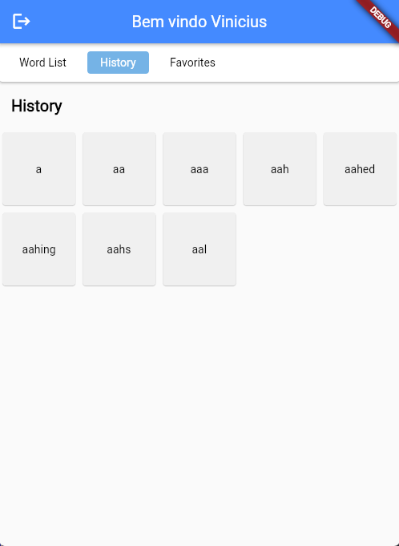

# Mobile Dictionary

## Informações sobre implementação

- O aplicativo foi desenvolvido utilizando Flutter para o frontend e Node.js para o backend. O banco de dados MySQL foi empregado para armazenar as informações de login dos usuários.

- No backend, foram implementadas três rotas: duas para realizar o registro e login dos usuários, e uma terceira para carregar os dados de 370.000 palavras em inglês.

```
http://localhost:5001/api/auth/register
```

```
http://localhost:5001/api/auth/login
```

```
http://localhost:5001/api/dados/dicionario
```

- O dataset disponibilizado contém, em sua maioria, palavras que não estão presentes na [Free Dictionary API](https://dictionaryapi.dev/). Por isso, foi criada uma tela que verifica e informa quando um dado não está disponível na API.

- Foi utilizado o SharedPreferences para armazenar dados localmente no Flutter, e a biblioteca audioplayers foi empregada para implementar o player de áudio do aplicativo.

- O banco MySQL foi utilizado com duas tabelas, conforme descrito abaixo: uma contém informações sobre os usuários e a outra armazena o [dataset](https://github.com/dwyl/english-words/blob/master/words_dictionary.json), que foi utilizado para criar os cards e realizar as buscas na API do dicionário.

<p align="center">
  
</p>

## Telas

- As telas abaixo correspondem à autenticação do usuário, onde ele realiza o login e o registro. Apenas essas duas telas foram integradas ao backend em Node.js, permitindo o registro do usuário no banco de dados MySQL ou a verificação da existência do usuário pelo e-mail.

<p align="center">
  
  
</p>

- As três telas abaixo correspondem à página de visualização dos cards. Nela, você encontra a lista de cards na Work List. Ao navegar pelos cards, eles são adicionados à aba Histórico. Além disso, ao clicar na estrela, o card é adicionado aos Favoritos, e você pode removê-lo desmarcando a estrela presente dentro do card.

<p align="center">
  
  
  
</p>

- A tela do card possui três variações: o card completo, que exibe texto, significado e áudio; o card incompleto, que apresenta apenas o texto e o significado, com o áudio indisponível; e, na maioria dos casos do dataset, o card sem informações, que exibe uma mensagem informando que não há dados disponíveis para a palavra.

<p align="center">
  
  
  
</p>

- Foi utilizado um script em Python para carregar o dataset no MySQL. Esse script pode ser encontrado na pasta raiz, sob o nome **loaddata**.

## Rodando o Projeto em LocalHost

- Primeiro passo para iniciar o projeto é iniciar o MySql e criar as tabelas (As 2 tabelas principais foram criadas manualmente).
- O nome do banco foi **mobiledictionary**.

```sql
-- Query para criar a tabela usuario
CREATE TABLE users (
  id INT AUTO_INCREMENT PRIMARY KEY,
  name VARCHAR(100) NOT NULL,
  email VARCHAR(100) NOT NULL UNIQUE,
  password VARCHAR(255) NOT NULL,
  borndate VARCHAR(255) NOT NULL,
   created_at TIMESTAMP DEFAULT CURRENT_TIMESTAMP
);
```

```sql
-- Query para criar a tabela Dicionario
CREATE TABLE dicionario (
  id INT AUTO_INCREMENT PRIMARY KEY,
  chave VARCHAR(255) NOT NULL,
  valor INT NOT NULL
);
```

## Carregando dataset no MySQL

- Depois da tabela dicionario criado basta executar o script, alterando as informacoes do seu banco, login e senha.

- Criando enviroment.

```shell
python -m venv env
```

- Entrando na env.

```shell
cd env/Scripts/activate
```

- Instalando dependências.

```shell
pip install -r requirements.txt
```

- Para sair da env.

```shell
deactivate
```

## Iniciando Backend e Frontend

- Depois de iniciado o Mysql e criado as tabelas, basta iniciar o backend em nodejs.
- Acessando o dirétorio do projeto.

```shell
cd .\backend\
```

- Instalando as dependências.

```shell
npm install
```

- Iniciando o backend com o npm.

```shell
npm start
```

- Iniciando o frontend com Flutter.
- Acessando o dirétorio do projeto.

```shell
cd .\mobiledictionary\
```

- Instalando as dependências.

```shell
flutter pub get
```

- Iniciando o frontend.

```shell
flutter run
2
```

## Linguagens de Desenvolvimento

&nbsp;
&nbsp;


## Desenvolvimento ✏

**Feito por**: [Vinícius Henrique Giovanini](https://github.com/viniciushgiovanini)

> This is a challenge by [Coodesh](https://coodesh.com/)
